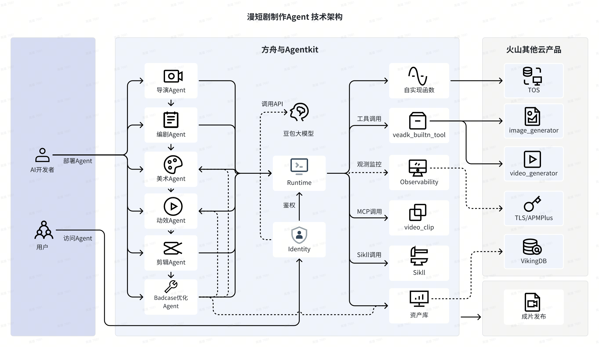

# AI Manga Workflow - 智能漫剧生成工作流

基于火山引擎 VeADK 和 AgentKit 构建的全自动 AI 漫剧生成系统，展示了多智能体协作完成复杂创意任务的能力。

## 概述

本系统构建了一个完整的漫剧（Manga Video）制作流水线，通过多个专业 Agent 的分工协作，将用户的简短创意转化为包含分镜脚本、画面绘制、动效生成和视频剪辑的完整漫剧作品。同时包含质量优化机制，支持对生成结果进行精细化调整。

## 核心功能

- **全流程自动化**：从创意到成片的一站式生成。
- **层级架构**：
  - **Root Router**：总控路由，负责任务分发（新建项目 vs 优化修复）。
  - **Sequential Workflow**：顺序执行核心制作流程（导演 -> 编剧 -> 美术 -> 动效 -> 剪辑）。
- **专业分工**：每个 Agent 专注于特定领域的任务（如编剧专注脚本，美术专注画面）。
- **工具集成**：集成了文生图（Image Generation）、图生视频（Video Generation）等 AI 能力。

## Agent 架构



```text
用户请求
    ↓
Root Router Agent（总控路由）
    ├── Manga Workflow Agent（核心制作流 - 顺序执行）
    │   ├── Director Agent（导演：创意简报与统筹）
    │   ├── Screenwriter Agent（编剧：分镜脚本创作）
    │   ├── Art Agent（美术：角色与场景绘制）
    │   ├── Motion Agent（动效：动态视频生成）
    │   └── Editor Agent（剪辑：视频拼接与成片）
    │
    └── Badcase Optimizer Agent（优化师 - 独立任务）
        └── 针对特定镜头或画面进行修复与优化
```

### 核心组件

| 组件 | 描述 |
| - | - |
| **主 Agent** | [agent.py](agent.py) - 定义了 Root Router 和 Sequential Workflow，负责整体编排。 |
| **子 Agent** | [sub_agents/](sub_agents/) - 包含所有专业子 Agent 的实现。 |
| **- Director** | [sub_agents/director_agent.py](sub_agents/director_agent.py) - 负责创意策划。 |
| **- Screenwriter** | [sub_agents/screenwriter_agent.py](sub_agents/screenwriter_agent.py) - 负责剧本创作。 |
| **- Art** | [sub_agents/art_agent.py](sub_agents/art_agent.py) - 负责画面生成。 |
| **- Motion** | [sub_agents/motion_agent.py](sub_agents/motion_agent.py) - 负责动效生成。 |
| **- Editor** | [sub_agents/editor_agent.py](sub_agents/editor_agent.py) - 负责剪辑合成。 |
| **- Optimizer** | [sub_agents/badcase_optimizer_agent.py](sub_agents/badcase_optimizer_agent.py) - 负责质量修复。 |
| **工具集** | [tools/](tools/) - 封装了生图、生视频等外部工具调用。 |
| **Prompts** | [prompts.py](prompts.py) - 集中管理各 Agent 的系统指令（System Prompts）。 |
| **运行脚本** | [main.py](main.py) - 本地运行脚本，直接执行工作流。 |

## 目录结构说明

```bash
ai_manga_workflow/
├── agent.py                      # 主 Agent 定义与 HTTP Server 入口
├── main.py                       # 本地运行脚本 (CLI 模式)
├── prompts.py                    # 各 Agent 的 Prompt 定义
├── sub_agents/                   # 子 Agent 实现
│   ├── director_agent.py
│   ├── screenwriter_agent.py
│   ├── art_agent.py
│   ├── motion_agent.py
│   ├── editor_agent.py
│   └── badcase_optimizer_agent.py
├── tools/                        # 工具函数
│   ├── image_gen.py
│   ├── video_gen.py
│   └── ...
├── requirements.txt              # Python 依赖列表
├── .env                          # 环境变量配置 (需自行创建)
└── README.md                     # 项目说明文档
```

## 本地运行

### 前置准备

**1. 开通火山方舟模型服务：**
- 访问 [火山方舟控制台](https://exp.volcengine.com/ark?mode=chat)
- 开通所需的模型服务（如 Doubao-pro, Seedream, Seedance 等）。

**2. 获取火山引擎访问凭证：**
- 获取 Access Key (AK) 和 Secret Key (SK)。
- 获取 Ark API Key。

### 依赖安装

建议使用 Python 3.10+ 环境。

```bash
# 进入项目目录
cd ai_manga_workflow

# 安装依赖
pip install -r requirements.txt
```

### 环境配置

在项目根目录下创建 `.env` 文件，并填入以下配置：

```ini
# 火山引擎鉴权
VOLCENGINE_ACCESS_KEY=your_ak
VOLCENGINE_SECRET_KEY=your_sk
ARK_API_KEY=your_ark_api_key

# 模型 Endpoint 配置
# 用于文本推理 (Director, Screenwriter 等)
MODEL_ENDPOINT_TEXT=your_doubao_pro_endpoint
# 用于生图 (Art Agent)
MODEL_ENDPOINT_IMAGE=your_seedream_endpoint
# 用于生视频 (Motion Agent)
MODEL_ENDPOINT_VIDEO=your_seedance_endpoint

# TOS 对象存储配置 (用于存储生成的素材)
TOS_ENDPOINT=tos-cn-beijing.volces.com
TOS_REGION=cn-beijing
TOS_BUCKET_NAME=your_bucket_name
```

### 启动运行

#### 方式一：命令行直接运行（推荐调试）

直接运行 `main.py`，它会模拟用户请求并执行完整流程。

```bash
python main.py
```

默认请求示例（可在 `main.py` 中修改）：
> "Generate a cyberpunk style manga about a courier girl delivering a mysterious package in Neo-Tokyo."

#### 方式二：启动 HTTP 服务

运行 `agent.py` 启动兼容 AgentKit 协议的 HTTP 服务。

```bash
python agent.py
# 服务将监听 http://0.0.0.0:8000
```

## AgentKit 部署

本此项目支持通过 AgentKit 部署到云端环境。

### 1. 配置部署参数

```bash
# 初始化配置
agentkit config \
    --agent_name "ai_manga_workflow" \
    --entry_point "agent.py" \
    --launch_type "cloud" \
    --image_tag "v1.0.0" \
    --region "cn-beijing" \
    --tos_bucket "$DATABASE_TOS_BUCKET" \
    --runtime_envs ARK_API_KEY="$ARK_API_KEY" \
    --runtime_envs VOLCENGINE_ACCESS_KEY="$VOLCENGINE_ACCESS_KEY" \
    --runtime_envs VOLCENGINE_SECRET_KEY="$VOLCENGINE_SECRET_KEY" \
    --runtime_envs MODEL_AGENT_API_KEY="$MODEL_AGENT_API_KEY" \
    --runtime_envs MODEL_IMAGE_NAME="$MODEL_IMAGE_NAME" \
    --runtime_envs MODEL_VIDEO_NAME="$MODEL_VIDEO_NAME" \
    --runtime_envs DATABASE_TOS_BUCKET="$DATABASE_TOS_BUCKET" \
    --runtime_envs DATABASE_TOS_REGION="$DATABASE_TOS_REGION" \
    --runtime_envs DATABASE_VIKING_COLLECTION="$DATABASE_VIKING_COLLECTION"
```
根据提示输入应用名称、入口文件 (`agent.py`) 等信息。

### 2. 启动云端服务

```bash
agentkit launch
```

### 3. 调用测试

```bash
agentkit invoke '生成一个关于古代剑客的漫剧，风格为水墨风。'
```

## 扩展方向

1.  **更精细的控制**：在 Director Agent 中增加更详细的风格参数控制。
2.  **人机交互**：在 Screenwriter 生成脚本后增加人工审核环节（Human-in-the-loop）。
3.  **多模态输入**：支持用户上传参考图或小说文本作为输入。

## 参考资料

- [VeADK 官方文档](https://volcengine.github.io/veadk-python/)
- [AgentKit 开发指南](https://volcengine.github.io/agentkit-sdk-python/)

## 代码许可

本工程遵循 Apache 2.0 License
